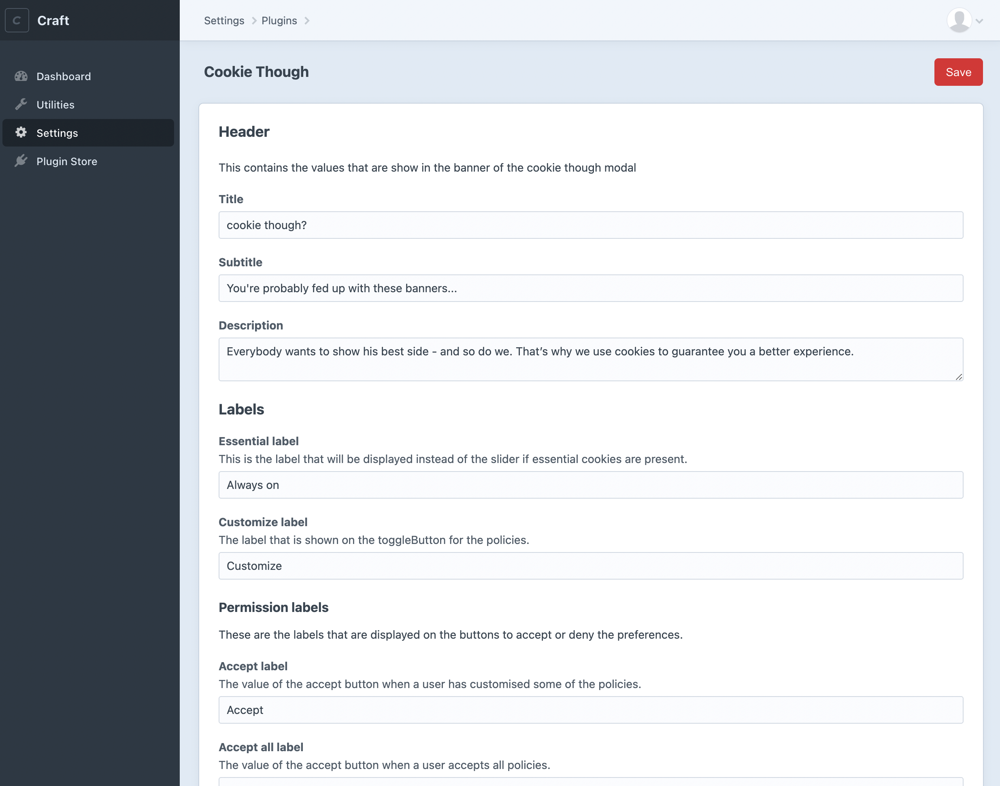

# Cookie Though plugin for Craft CMS 4.x

Install and configure [Cookie Though](https://cookiethough.dev/) with ease.

This plugin provides support for the installation and the configuration of Cookie Though. It provides the latest version of Cookie Though, it saves preferences in CraftCMS and exposes those to the Cookie Though instance, that is being used with the CDN implementation. A global variable `CookieThough` is available to trigger more features of CookieThough.

It doesn’t implement the cookies, so implementing the cookies is **up to you**!

More info on how to use Cookie Though can be found on the [official documentation website](https://cookiethough.dev/api/).

## Styling

This plugin doesn't provide support for styling, as that's something that you should define in your application's stylesheet. [How to style Cookie Though?](https://cookiethough.dev/styling/)

## Requirements

This plugin requires Craft CMS 4.0.0 or later.

## Installation

To install the plugin, follow these instructions.

1. Open your terminal and go to your Craft project:

        cd /path/to/project

2. Then tell Composer to load the plugin:

        composer require timvermaercke/cookie-though

3. In the Control Panel, go to Settings → Plugins and click the “Install” button for Cookie Though.

## Configuring Cookie Though

Go the plugin settings and configure Cookie Though the way you like.

## Cookie Though Roadmap

* [ ] Translatable config for multilingual applications
